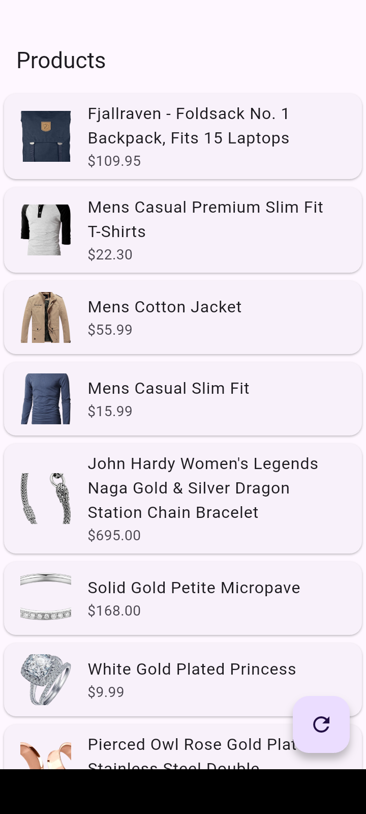

# 📱 Clean Architecture Flutter App


A Flutter application built using **Clean Architecture** and **BLoC state management**, demonstrating best practices in scalable app design and API integration.

This project was developed to showcase a maintainable architecture and real-world app flow as part of a portfolio for a Junior Flutter Developer role.

---

## 🧠 Project Overview

This app connects to the **Fake Store API** to fetch product data and displays it in a clean, responsive UI.  
It follows **Clean Architecture principles** by separating code into meaningful layers:

- **Data Layer** → Handles API calls, models, and repositories  
- **Domain Layer** → Business rules, entities, and use cases  
- **Presentation Layer** → UI, widgets, and BLoC (logic + state)

State management is handled via **BLoC**, ensuring a clear separation of business logic from UI.

---

## 📸 Screenshots (Add your images below)

### Product List



> ❗ Make sure screenshots are placed in `assets/screenshots/` with exact names.

---

## 🚀 Features

- Product listing with API data
- Clean and responsive UI
- Separates concerns using Clean Architecture
- BLoC for state management
- API error, loading, and success handling
- Scalable code structure

---

## 📦 Tech Stack

- Flutter & Dart  
- BLoC (flutter_bloc)  
- Clean Architecture  
- Fake Store API (https://fakestoreapi.com/)  
- Git & GitHub  

---

## 🔧 Setup & Installation

Follow the steps below to run the project locally:

### 1️⃣ Clone the Repository

```bash
git clone https://github.com/Chorusraj/Clean_Architecture.git
cd Clean_Architecture
```

### 2️⃣ Install Dependencies

```bash
flutter pub get
```

### 3️⃣ Run the App

```bash
flutter run
```
---

## 📁 Clean Architecture Layers

```
lib/
├── core/                  # Generic utilities
├── features/
│   ├── products/
│   │   ├── data/          # Models, data sources, repository implementations
│   │   ├── domain/        # Entities, repository interfaces, use cases
│   │   └── presentation/  # Bloc, pages, widgets
└── main.dart
```

---

## 🧪 Testing

Unit tests are recommended but not included in this version.
You can add tests for BLoC and use cases using packages like bloc_test and mocktail.

Example:
```bash
flutter test
```

---

## 📌 Notes

- This is a beginner-to-intermediate level project for learning Clean Architecture in Flutter.
- Great foundation for adding features like cart, favorites, search, or filters.
- Can be extended with Firebase, local storage, or integration tests.

---

## 🔮 Future Enhancements

- Add product details page with cart integration
- Persist cart locally (Hive / SQLite)
- Add favorites and search functionality
- Pagination for product list
- Integration tests using flutter_test

---

## 👨‍💻 Author

**Chorus Rajbanshi** - Flutter Developer (Fresher)

- GitHub: https://github.com/Chorusraj
- LinkedIn: https://www.linkedin.com/in/chorus-rajbanshi-32ba7a330/